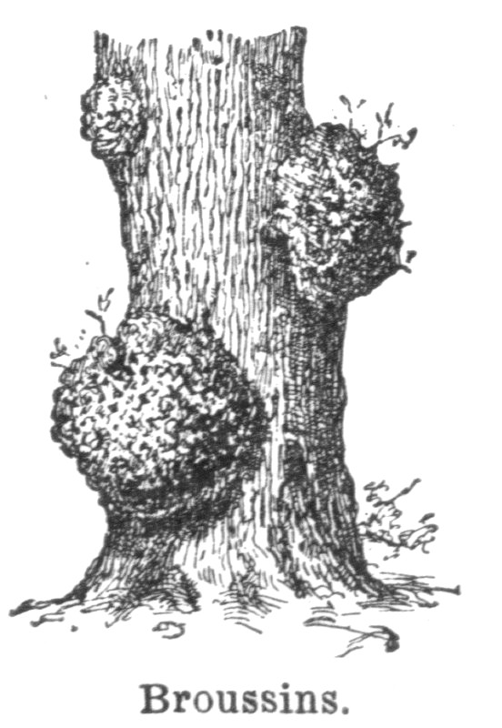

# spec-tools  

Clojure/Script utilities on top of [clojure.spec](http://clojure.org/about/spec). Bundled in one project but features in separate namespaces.

* [Spec Coercion](docs/01_coercion.md)
* [Data Specs](docs/02_data_specs.md)
* [Spec Visitors](docs/03_spec_visitor.md)
* [Generating JSON Schemas](docs/04_json_schema.md)
* [Generating Swagger2 Schemas](docs/05_swagger.md)
* [Generating OpenAPI3 Schemas](docs/06_openapi.md)
* [Spec Walker](docs/09_spec_walker.md)
* [Spec Records](docs/07_spec_records.md)
* [Spec Driven Transformations](docs/10_spec_transformations.md)

Posts:
* [Spec Transformers](https://www.metosin.fi/blog/spec-transformers/)
* [Clojure.spec with Ring (& Swagger)](http://www.metosin.fi/blog/clojure-spec-with-ring-and-swagger/)
* [Clojure.spec as a Runtime Transformation Engine](http://www.metosin.fi/blog/clojure-spec-as-a-runtime-transformation-engine/)
* [Schema & Clojure Spec for the Web Developer](http://www.metosin.fi/blog/schema-spec-web-devs/)

### [Full Documentation](https://cljdoc.org/d/metosin/spec-tools/CURRENT)

## Latest version

Requires Java 1.8, tested with Clojure `1.10.0` and ClojureScript `1.10.520`+.

Status: **Alpha** (as spec is still alpha too).

## License

Copyright © [Metosin Oy](http://www.metosin.fi) and contributors. Distributed under the Eclipse Public License 2.0, see `LICENSE`.

[Picture](https://fi.wiktionary.org/wiki/Tiedosto:Broussins_(burr_-_burl).jpg), Noveau Larousse Ilustré (Larousse XIXs. 1866-1877). [Public domain](https://en.wikipedia.org/wiki/Public_domain), via Wikimedia Commons.

The spell-spec library, Copyright © 2018 Bruce Hauman, is distributed under the Eclipse Public License as well.
